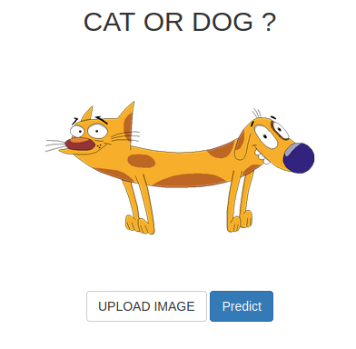
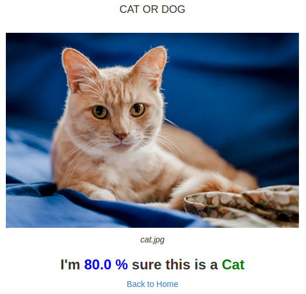

# Cat or Dog

A simple Flask App that can classify an image as Dog or Cat using a convolutional neural network model.
 
 
 

  

 
 

  

## Used Tools
- Numpy
- Tensorflow
- Keras
- Flask
- Heroku
 
 

## Credit
Credit to the following repository:  
https://github.com/kayveen/DogorCat

    
    
    
    
  
    
